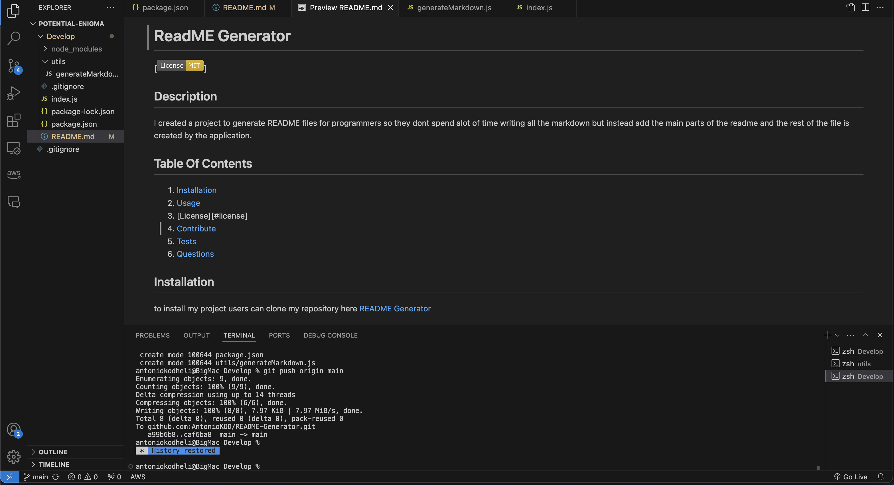

  
  # README Generator
  
  
  ## Description
  
  A README Generator Node application that will help developers
to creathe their README files faster and not think too much 
on how to layout a file but just enter the information and have one generated for them

  ## Table Of Contents
  1. [Installation](#installation)
  2. [Usage](#usage)
  3. [License](#license)
  4. [Contribute](#contributing)
  5. [Tests](#tests)
  6. [Questions](#questions)

  ## Installation 

  To install this project on your local machine clone the repo
[REPO](https://github.com/AntonioKOD/README-Generator)

  ## Usage

   After cloning the repo users can run node index on the terminal 
and this will start the application

  

  ## License

  
  [MIT License](https://opensource.org/licenses/MIT)

  ## Contributing

  To contribute on the project users can fork the repo, or clone it and create issues
or add features to it through other branches and improve the application

  ## Tests

  Tests can be run after adding the "add tests" to the commit message and then creating 
a workflow on the actions tab in github.
And also can run try catch code blocks to see what goes wrong with the application.

  ## Questions 

  [antonio_kodheli@icloud.com](mailto:antonio_kodheli@icloud.com)

  [My Github](https://github.com/AntonioKOD)

